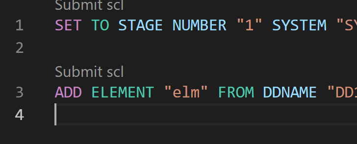
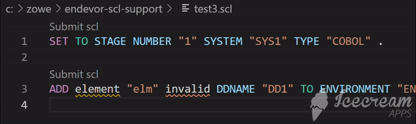
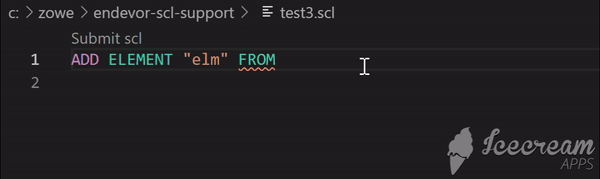
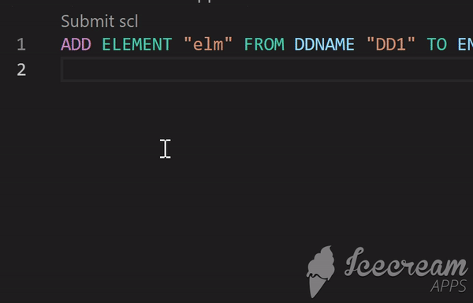

# endevor-scl-support README

This is a vscode extension of Endevor SCL language support

## Features

Syntax highlighting.

Syntax diagnose and quick fix.

Autocompletion.

Format an entire document.

Submit scl using codeLens.

## Extension Settings

This extension contributes the following settings:

* `endevorSclLanguageServer.maxNumberOfProblems`: the maximum number of syntax problems the language server will push to client.
* `endevorSclLanguageServer.isREST`: by default the language server give syntax diagnose based on classic SCL grammar. When this option is set to true, the language server give diagnose based on Endevor REST API standards, which is more tolerant than classic SCL grammar.
